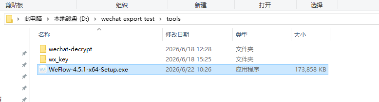
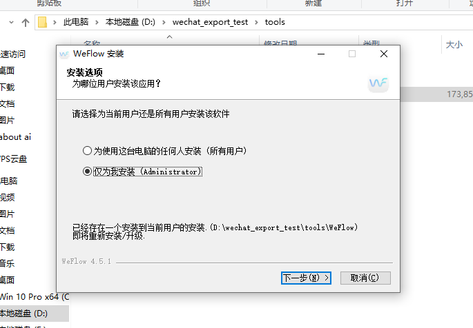
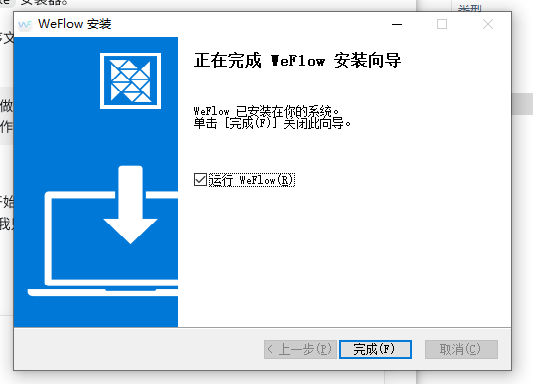

# WeFlow 操作教程

## 目录

1. 准备工作
2. 安装 WeFlow
3. 找到微信数据库位置
4. 首次配置与自动获取密钥
5. 创建导出任务
6. 等待任务完成
7. 将导出包交给 Codex
8. 常见问题

## 1. 准备工作

- 系统：Windows 10/11 x64。
- 准备 WeFlow 4.5.1 x64 安装器。
- 确保安装盘和导出盘有足够空间；包含图片、视频和文件时，导出包可能很大。
- 操作密钥前，先保存微信中未完成的输入或文件传输。
- 全程不要把密钥、聊天记录或导出目录上传到互联网。

## 2. 安装 WeFlow

1. 双击 `WeFlow-4.5.1-x64-Setup.exe`。



2. 推荐选择“仅为我安装”，点击“下一步”。



3. 将安装位置放在空间较大的磁盘。
4. 完成安装时保留“运行 WeFlow”勾选，点击“完成”。
5. WeFlow 会自动启动，桌面也会生成快捷方式。



## 3. 找到微信数据库位置

WeFlow 首次配置时可能需要确认微信数据库或文件目录。不要凭感觉猜路径。

1. 打开 Windows 微信。
2. 点击左下角“三横线 / 设置”。
3. 进入“文件管理”或类似入口。
4. 查看微信文件、数据所在位置。
5. 回到 WeFlow，选择对应的数据库目录或上级微信数据目录。

只允许定位目录。不要移动、删除、重命名微信原始数据库，也不要把数据库文件上传或发给 Codex。

## 4. 首次配置与自动获取密钥

WeFlow 首次启动时会引导选择数据库目录、缓存目录并识别账号。以前配置过的电脑可能直接进入“解密密钥”页面。

1. 按界面说明完成数据库目录和缓存目录配置。
2. 到“解密密钥”页面后，先保存微信中的工作。
3. 按 WeFlow 提示完全退出当前登录的微信。
4. 点击“自动获取密钥”。
5. 严格按照 WeFlow 弹出的指示操作。
6. 获取完成后点击“完成并返回”。

安全要求：不要复制、截图、发送或写下密钥。Codex不需要看到密钥。

如果数据库量很大，首次加载可能较慢，甚至短暂报错。先等待几分钟并刷新；确认路径、微信退出状态、权限和磁盘空间后，再判断是否需要重新配置。不要因为第一次报错就重装。

## 5. 创建导出任务

1. 点击左侧导航栏“导出”。
2. 在页面顶部选择导出位置，建议使用空间充足的磁盘。
3. 可按需要打开“更多导出设置”。
4. 在“私聊”或“群聊”中搜索目标会话。
5. 点击该会话右侧的“导出”。
6. 对话文本导出格式选择 **ChatLab JSONL**。
7. 设置需要的时间范围；首次测试建议先选最近一周。
8. 按需选择图片、语音、视频、表情包和文件。
9. 设置文件大小上限；希望尽量完整时选择足够大的上限或“不限”，同时注意磁盘空间。
10. 按需开启“语音转文字”。
11. 选择发送者名称显示方式：群聊昵称优先、备注优先或微信昵称。
12. 点击“创建导出任务”。

推荐设置：

- 文本格式：ChatLab JSONL。
- 发送者名称：团队内部通常使用“备注优先”；需要还原群内称呼时使用“群聊昵称优先”。
- 媒体：分析需要什么就勾选什么；无法预判时全部勾选。
- 文件上限：不能超过业务中可能出现的大文件。

### 增量导出建议

如果不是第一次导出，不建议每次都选择“全部时间”。更稳妥的做法是：

1. 先查看上一次成功导出的 `export_integrity_report.md`。
2. 找到上次末条消息时间。
3. 下次在 WeFlow 中选择“今天”或“从上次导出日期到今天”。
4. 如果只能按日期选择，宁可从上次日期当天多导一点，再由 Codex 做本地去重。
5. 导出完成后重新生成验收报告，把新的末条时间作为下一次增量起点。

这样可以明显减少等待时间，也能避免因为“全部时间”导出造成大群聊耗时过长。

经验耗时：已完成首次配置后，当天增量通常约 2–5 分钟/群；媒体较多的群约 5–15 分钟/群。5 个群大约 15–35 分钟，10 个群大约 30–70 分钟。首次全量导出会更慢，应单独安排时间。

## 6. 等待任务完成

1. 创建任务后打开“任务中心”。
2. 查看消息、媒体、写入和缓存进度。
3. 任务仍显示“进行中”时不要移动导出目录。
4. 完成后点击“目录”打开结果。

典型目录结构：

```text
导出目录/
├─ texts/       ChatLab JSONL
├─ images/      图片
├─ file/        文件和语音附件
├─ videos/      视频
└─ emojis/      表情包
```

不要只发送 `texts` 文件夹。交给 Codex 时应保留整个目录及相对路径。

## 7. 将导出包交给 Codex

在 Codex 中说明：

```text
请使用 WeFlow 微信聊天导出 Skill，检查这个导出目录的完整性，然后问我希望分析什么：
<把导出目录拖入 Codex，或粘贴完整路径>
```

Codex应先报告 JSONL 是否有效、消息数量、时间边界、媒体引用数量及缺失数量，再开始分析。

## 8. 常见问题

### 双击 JSONL 无法打开

这是电脑没有关联查看程序，不代表文件损坏。Codex可以直接读取；也可以用记事本或代码编辑器查看。

### Codex只能看到文字，看不到图片

确认交给 Codex 的是整个导出目录，而不是单独的 JSONL。不要改变 `texts`、`images`、`file`、`videos` 等文件夹的相对位置。

### 媒体缺失

检查导出时是否勾选对应媒体类型、文件大小上限是否过低、任务是否真正完成。回到 WeFlow 重新导出，不要手工修改 JSONL。

### 重新配置时看不到完整向导

WeFlow 可能复用了之前的数据库目录和缓存目录配置，只显示“解密密钥”页面。按当前页面提示继续即可。

### 首次加载慢或报错

聊天记录很多时，WeFlow 首次读取数据库可能需要较长时间。先等待几分钟并点击刷新。仍失败时再检查数据库目录是否选对、微信是否已退出、磁盘空间是否足够、当前用户是否有读取权限。
